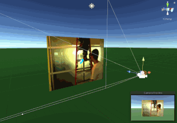
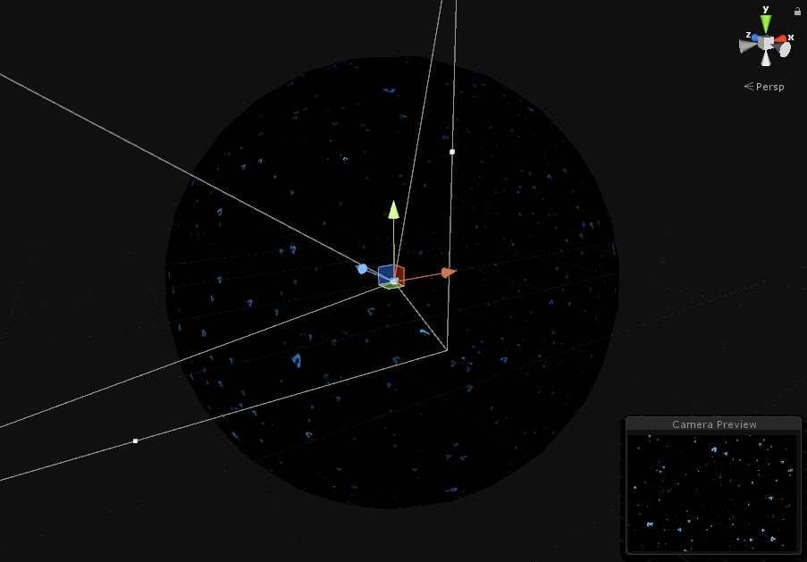
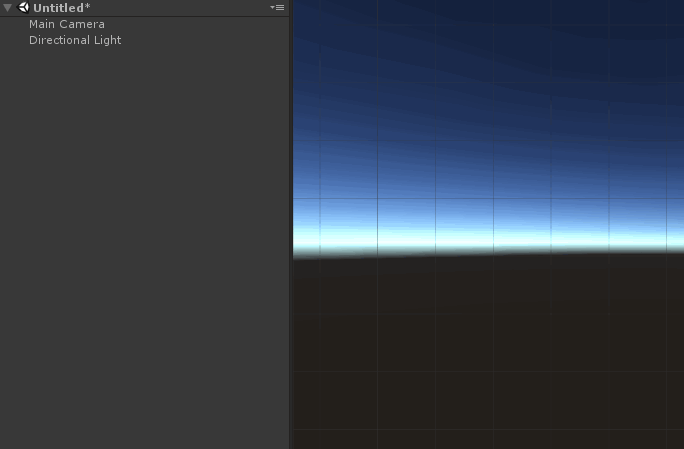
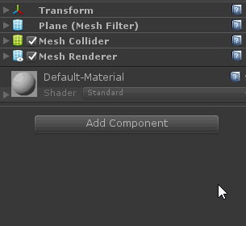
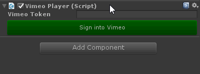

Vimeo Unity SDK
========================

This SDK lets you stream 2D and 360 videos from your own Vimeo account into a Unity app. 

## Getting started

The SDK comes with the following example Unity scenes in the `Vimeo/Scenes` folder. Please note these demos don't work out of the box. You will need to authorize your Vimeo account and select your own video test. [Skip to step #3](#3-sign-into-your-vimeo-account) to learn how to sign in.

<table>
  <tr>
    <td style="width:33%">
       
      <b>Player</b> - Demos simple video streaming inside of a 3D environment.
    </td>
    <td style="width:33%">
       
      <b>360Player</b> - Demos how to stream 360 videos from Vimeo (supports 3D / stereoscopic video).
    </td>
    <td style="width:33%">
       
      <b>CanvasPlayer</b> - Demos how to build a canvas-based player with basic playback controls.
    </td>
  </tr>
</table>

### 1. Installation
Download the most recent `.unitypackage` from the [latest releases](https://github.com/vimeo/vimeo-unity-sdk/releases) and open it up.

### 2. Choose your playback method
Open up your Unity scene or create a new one. For streaming any Vimeo video, you will be using the `VimeoPlayer` component. There are two ways to setup the Vimeo player in Unity:

#### Prefab setup
The easiest way to get started is to either drag in one of the prefabs from `Vimeo/Resources/Prefabs` or simply right-click on your scene and the Vimeo Player from the `Video` menu:

#### Manual setup 
If you are setting up your own scene and want to specify your video "screen" and audio outputs, you can add the `Vimeo Player` component to your GameObject. 

### 3. Sign into your Vimeo account
Sign into your [Vimeo](https://vimeo.com) account (or create one if you haven't already) and make sure you have some videos uploaded. Please read the following two requirements to streaming Vimeo videos into Unity:

> The `VimeoPlayer` component requires video file access via the Vimeo API. Accessing video files is limited to [Vimeo Pro and Business](https://vimeo.com/upgrade) customers. 

> You can only stream videos from your own Vimeo account. Access to all videos is limited to partnership-level integrations. If you are interested in a partnership, reach out to casey@vimeo.com

* Click "Sign into Vimeo" which will ask you to authorize with your Vimeo account. 
* After authorizing, copy the token and paste it into the `Vimeo Token` field in Unity. 
* [Find your video](https://vimeo.com/manage/videos) and then copy the full URL or the video ID and paste it into the `Vimeo Video URL` field.
* If you are not using one of the existing prefabs, then you will need to assign a GameObject to the `Video Screen` field. Currently, we only support Mesh and RawImage GameObjects.
* `Audio Output` is optional. If left empty, a new audio object will be attached to the video screen. 
* For security reasons, the Vimeo token is not saved into the scene. But, if you plan on building this app so others can watch video, then be sure to check `Save token with scene`
 
 You're all set! Press play and you should now see your Vimeo video streaming in your app.

## Future support
We do not support the following features yet, but we hope to in the near future:
  
  - **In progress:** Real-time & offline video capture and uploading to Vimeo
  - Adaptive video playback (HLS/DASH). The `VimeoPlayer` component does allow you to set your streaming quality preference.
  - Vimeo Live streaming playback & publishing

## Contributing
There are many ways you can contribute. Make pull requestss or report bugs and make feature requests via a [GitHub issue](https://github.com/vimeo/unity-vimeo-player/issues).
